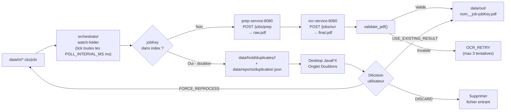

# Documentation développeur — comic2pdf-app

Bienvenue dans la documentation technique de **comic2pdf-app**. Ce guide s'adresse aux développeurs souhaitant contribuer, maintenir ou étendre le projet.

---

## Architecture globale

`comic2pdf-app` est composé de **3 services Python** orchestrés par un watch-folder, et d'une **application desktop JavaFX** pour l'interface utilisateur.

```
comic2pdf-app/
├── services/
│   ├── prep-service/      # Extraction CBZ/CBR → raw.pdf  (7z + img2pdf)
│   ├── ocr-service/       # OCR raw.pdf → final.pdf        (ocrmypdf + Tesseract)
│   └── orchestrator/      # Watch-folder + pipeline + dédup + heartbeats + métriques + HTTP
├── desktop-app/           # Interface JavaFX (3 onglets : Doublons / Jobs / Configuration)
├── data/                  # Volume partagé Docker (monté dans chaque service)
├── docker-compose.yml
├── run_tests.ps1          # Script global : pytest × 3 + mvn test
└── README.md
```

---

## Diagramme du flux de données



---

## Répertoires clés et leur rôle

| Répertoire | Service | Rôle |
|---|---|---|
| `services/prep-service/app/core.py` | prep | Filtrage images, tri naturel, conversion en PDF |
| `services/prep-service/app/main.py` | prep | FastAPI : endpoints `/info`, `/jobs/prep`, `/jobs/{id}` |
| `services/prep-service/app/utils.py` | prep | Fonctions filesystem partagées |
| `services/ocr-service/app/core.py` | ocr | Construction commande ocrmypdf, requeue au boot |
| `services/ocr-service/app/main.py` | ocr | FastAPI : endpoints `/info`, `/jobs/ocr`, `/jobs/{id}` |
| `services/orchestrator/app/core.py` | orch | jobKey, heartbeat, métriques, profil canonique |
| `services/orchestrator/app/main.py` | orch | `process_tick()`, `process_loop()`, doublons, stale jobs |
| `services/orchestrator/app/http_server.py` | orch | Serveur HTTP stdlib : `/metrics`, `/jobs`, `/config` |
| `services/orchestrator/app/utils.py` | orch | `sha256_file`, `atomic_write_json`, `validate_pdf`, etc. |
| `desktop-app/src/.../MainApp.java` | desktop | Point d'entrée JavaFX, TabPane 3 onglets |
| `desktop-app/src/.../MainView.java` | desktop | Onglet Doublons, dépôt fichier atomique |
| `desktop-app/src/.../JobsView.java` | desktop | Onglet Jobs, ScheduledService refresh 3s |
| `desktop-app/src/.../OrchestratorClient.java` | desktop | Client HTTP stdlib Java vers orchestrateur |
| `desktop-app/src/.../config/` | desktop | `AppConfig`, `ConfigService`, `ConfigView` |
| `desktop-app/src/.../duplicates/` | desktop | `DuplicateService`, `DuplicateDecision`, `DupRow` |

---

## Conventions de nommage

| Contexte | Convention | Exemples |
|---|---|---|
| Python — fonctions/variables | `snake_case` | `make_job_key`, `job_timeout_s` |
| Python — constantes de module | `UPPER_CASE` | `MAX_ATTEMPTS_PREP`, `DATA_DIR` |
| Python — modules/fichiers | `snake_case` | `core.py`, `http_server.py` |
| Java — classes/interfaces | `PascalCase` | `DuplicateService`, `OrchestratorClient` |
| Java — méthodes/champs | `camelCase` | `listDuplicates`, `jobKey` |
| Java — constantes | `UPPER_CASE` | `MAX_RETRY`, `DEFAULT_URL` |
| JSON — clés d'état | `camelCase` | `jobKey`, `updatedAt`, `rawPdf` |
| Fichiers data | `snake_case` | `prep.heartbeat`, `state.json` |
| DB (si future) | `snake_case` | `provider_key`, `barcode_norm` |

---

## Séparation des responsabilités

### Couche Desktop

```
MainApp (point d'entrée)
  ├── MainView           → délègue à DuplicateService (logique filesystem)
  ├── JobsView           → délègue à OrchestratorClient (HTTP)
  └── ConfigView         → délègue à ConfigService (persistance) + OrchestratorClient (POST /config)
```

**Règles** :
- `MainView`, `JobsView`, `ConfigView` : **zéro logique métier** — uniquement UI et délégation
- `DuplicateService` : logique filesystem doublons, **zéro JavaFX**
- `OrchestratorClient` : HTTP pur, **zéro JavaFX**, **zéro logique métier**
- `ConfigService` : persistance `config.json`, **zéro JavaFX**

### Couche Services Python

```
main.py     → FastAPI / boucle principale, startup, routing
core.py     → logique métier pure et testable (pas d'effets de bord à l'import)
utils.py    → fonctions filesystem réutilisables
logger.py   → configuration logging (JSON ou texte selon LOG_JSON)
```

---

## Structure des packages `desktop-app`

Depuis le refactoring du 2026-03-01, le module JavaFX suit une architecture MVC propre :

```
com.comic2pdf.desktop
  ├── MainApp.java                   # Point d'entrée JavaFX
  ├── client/
  │   └── OrchestratorClient.java    # Client HTTP vers l'API orchestrateur
  ├── service/
  │   ├── AppServices.java           # Conteneur de services (injecté dans les controllers)
  │   └── DuplicateService.java      # Logique filesystem doublons (testable sans FX)
  ├── config/
  │   ├── AppConfig.java             # POJO de configuration persistée
  │   └── ConfigService.java         # Lecture/écriture config.json (AppData/home)
  ├── model/
  │   ├── DupRow.java                # ViewModel JavaFX — ligne de doublon
  │   ├── JobRow.java                # ViewModel JavaFX — ligne de job
  │   └── DuplicateDecision.java     # Enum : USE_EXISTING_RESULT | DISCARD | FORCE_REPROCESS
  ├── ui/controller/
  │   ├── MainController.java        # Controller racine (TabPane + fx:include)
  │   ├── DuplicatesController.java  # Onglet Doublons
  │   ├── JobsController.java        # Onglet Jobs (avec auto-refresh)
  │   └── ConfigController.java      # Onglet Configuration
  └── util/
      └── FxUtils.java               # Utilitaires UI partagés (openDirectory, showError…)
```

> Les anciens packages `com.comic2pdf.desktop.DupRow`, `JobRow`, `OrchestratorClient`
> et `com.comic2pdf.desktop.duplicates.*` existent encore comme **stubs `@Deprecated`**
> pour la compatibilité descendante. Ils seront supprimés lors du prochain cycle de cleanup.
> Voir `docs/ia/rapports-execution/RAPPORT_IMPLEMENTATION_2026-03-01.md`.

---

## Liens vers la documentation développeur détaillée

| Document | Description |
|---|---|
| [setup.md](setup.md) | Setup Python/Java, variables d'environnement complètes, ports |
| [testing.md](testing.md) | Tests Python (pytest) + Java (JUnit 5), stratégie de mock |
| [operations.md](operations.md) | Observabilité HTTP, métriques, logs structurés, janitor |
| [contributing.md](contributing.md) | Invariants, SOLID, checklist PR, conventions |

---

## Licence

Ce projet est distribué sous **licence MIT** — voir [`LICENSE`](../../LICENSE).

Les composants tiers (Ghostscript, Tesseract, 7-Zip, OCRmyPDF, OpenJFX, etc.) ont leurs propres licences,
listées dans [`THIRD_PARTY_NOTICES.md`](../../THIRD_PARTY_NOTICES.md).

> ⚠️ **Ghostscript (AGPL-3.0)** : installé dans l'image Docker `ocr-service`, peut imposer des
> obligations de distribution du code source lors de la redistribution d'un binaire dérivé.
> Voir [`THIRD_PARTY_NOTICES.md`](../../THIRD_PARTY_NOTICES.md) pour le disclaimer complet.

---

## Retour à la documentation principale

[← Retour à docs/README.md](../README.md)

